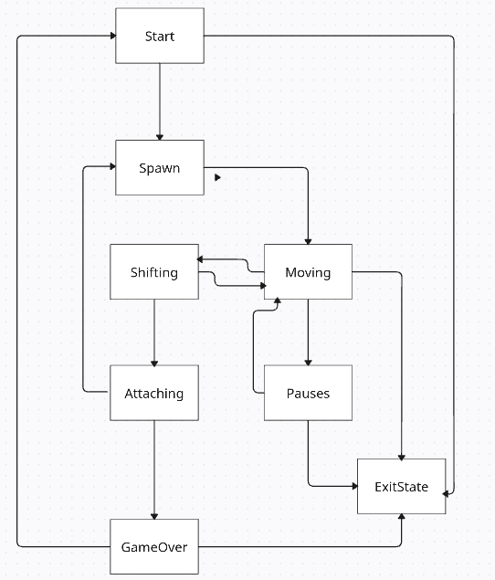

# 🧱 BrickGame Tetris

Классическая игра Тетрис на C с использованием конечного автомата и ncurses



## Особенности
- 7 классических фигур тетрамино
- Система уровней и подсчета очков
- Сохранение рекордов
- Терминальный интерфейс (ncurses)
- Конечный автомат для управления состоянием игры

## 🛠 Сборка и установка
```bash
# Установка зависимостей (Debian/Ubuntu)
sudo apt install build-essential libncurses5-dev check

# Сборка и запуск
make install
./Tetris
```

## ⌨ Управление
| Клавиша | Действие          |
|---------|-------------------|
| ← →     | Движение         |
| ↓       | Ускоренное падение|
| Пробел  | Вращение         |
| P       | Пауза            |
| S       | Старт/Рестарт    |
| Q       | Выход            |

## 📚 Документация
Полная документация: [docs/dvi.html](docs/dvi.html)

## 🧪 Тестирование
```bash
make test          # Запуск unit-тестов
make gcov_report   # Отчет о покрытии кода
make valgrind_test # Проверка утечек памяти
```

## 🧩 Структура проекта
```
brick_game/tetris/ - Логика игры
gui/cli/           - Терминальный интерфейс
tests/             - Юнит-тесты
docs/              - Документация
```

> Проект выполнен в рамках учебного курса по программированию